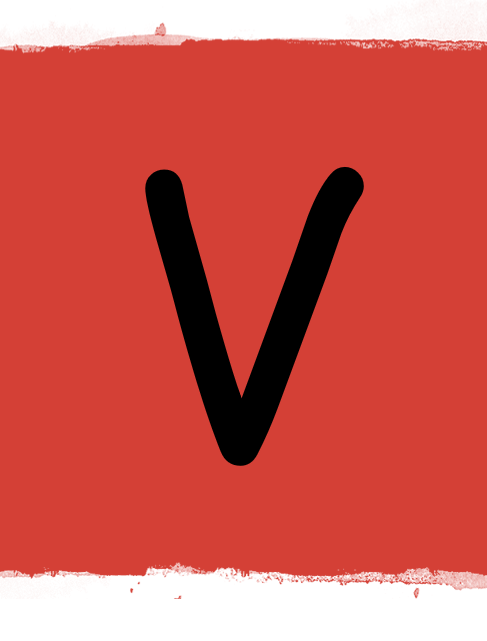

 Villainously Monologues

A full-stack MERN app, with multiple relationships and CRUD functionality, allowing users to share, 

## A bit more detail

This is a fully working API with authenticated routes, along with register and login endpoints. The API returns a JWT token at login, which can be used to access specific endpoints that would otherwise be unavailable.
